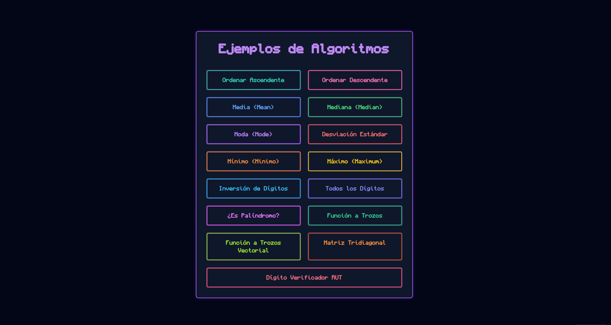

# Basic Algorithms Simulation Suite

## Overview
Basic Algorithms Simulation Suite is a collection of interactive visualizations demonstrating fundamental statistical and mathematical algorithms.



## Features
- **Interactive Dashboards:** Explore algorithms through real-time simulations.
- **Pseudocode Visualizations:** View algorithm logic alongside simulations for deeper understanding.
- **Comprehensive Algorithm Set:**
    - Statistical Analysis: Mean, Median, Mode, Standard Deviation.
    - Data Processing: Maximum/Minimum values, Digit Analysis.
    - Sorting Algorithms: Ascending and Descending sorts.
    - Mathematical Operations: Piecewise functions, Tridiagonal matrices.
- **Modern Responsive UI:** Built with HTML5, Vanilla JavaScript, and Tailwind CSS.

## Deployment
Live demo available at: [https://basic-algorithms.kks.qzz.io](https://basic-algorithms.kks.qzz.io)

## Local Setup
1. Clone the repository.
2. Install dependencies: `npm install`.
3. Start the server: `node server.js`.
4. Open your browser at `http://localhost:8004`.

## System Service Setup (Linux)
To keep the server running in the background and ensure it restarts on boot:

1. Copy the service file to the systemd directory:
   ```bash
   sudo cp algorithms-cei.service /etc/systemd/system/
   ```
2. Reload systemd to recognize the new service:
   ```bash
   sudo systemctl daemon-reload
   ```
3. Enable the service to start on boot:
   ```bash
   sudo systemctl enable algorithms-cei.service
   ```
4. Start the service immediately:
   ```bash
   sudo systemctl start algorithms-cei.service
   ```
5. Check the status:
   ```bash
   sudo systemctl status algorithms-cei.service
   ```

## License
Distributed under the MIT License. See `LICENSE.md` for more information.
